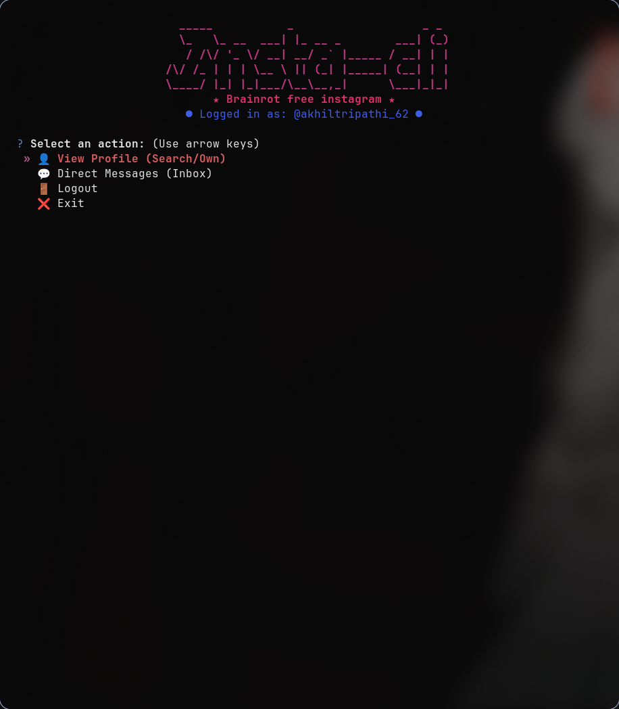

# Instagram CLI & TUI 📸 💻

A beautiful, functional, and robust Command Line Interface (CLI) and Terminal User Interface (TUI) for Instagram, written in Python.

## Screenshot



---

## Features

- 🔐 **Secure & Robust Authentication**: Handles 2FA/MFA verification codes and suspicious login security challenges (SMS/Email code prompts) interactively.
- 🍪 **Session Caching**: Saves cookies and session states to `~/.config/instagram_cli/` so you only have to log in once.
- 👤 **Profile Viewer**: Search for any user to check their bio, follower/following count, and browse their recent posts (you can't see the actual picture or reel; it only shows the post title, lil bro 🥀).
- 💬 **DM Chat Engine**: Real-time conversational interface for reading, refreshing, and replying to Direct Messages.
- 🛠 **Offline Mock Mode**: A fully-featured simulated database that runs offline without any Instagram credentials (perfect for testing and demonstrations!).

---

## Installation & Setup

### Option 1: Quick Install (Recommended)
You can run the provided installer script to install `insta-cli` directly to your system (requires Python 3 and virtual env support):

```bash
git clone https://github.com/akhiltripathi39/Insta-cli.git
cd Insta-cli
# Run with --user flag for current user (no sudo/root required)
./install.sh --user
```
*Note: Make sure `~/.local/bin` is in your `$PATH` environment variable. If it isn't, the script will show instructions on how to add it.*

To install system-wide (requires sudo):
```bash
sudo ./install.sh --system
```

#### On Windows (PowerShell):
Open PowerShell and run the installer script:
```powershell
Set-ExecutionPolicy Bypass -Scope Process
.\install.ps1
```
Once installed, you can execute the program from anywhere in your terminal (Linux/macOS/Windows) by typing:
```bash
insta-cli
```

### Option 2: Manual Local Setup (Run without installing)
If you prefer not to install the command globally:
1. Clone the repo:
   ```bash
   git clone https://github.com/akhiltripathi39/Insta-cli.git
   cd Insta-cli
   ```
2. Create a virtual environment:
   ```bash
   python3 -m venv venv
   ```
3. Install dependencies:
   ```bash
   ./venv/bin/pip install -r requirements.txt
   ```
4. Run using the local wrapper script:
   ```bash
   ./instagram-cli
   ```

---

## How to Use the CLI

### 1. Usage 

```bash
# Start the interactive TUI
insta-cli

# Log in using credentials
insta-cli login -u username -p password
```

*You will be prompted to securely type your Username and Password. If your account has 2FA enabled, it will prompt you for the verification code. If Instagram triggers a verification check, you will be prompted for the code sent to your SMS/Email.*

```bash
# Check login status (will say not logged in initially)
insta-cli status

# Search a user profile (e.g. nasa)
insta-cli profile nasa

# View your DMs inbox
insta-cli inbox

# Logout and clear cache
insta-cli logout

```

### 2. Mock Mode (You can try this first)
It's just for testing features with dummy information. Feel free to try it out first.
To use Mock Mode, just pass the `--mock` flag (e.g. insta-cli --mock profile meme_profile).

---

*If you get any error just dm me on instagram @akhiltripathi_62 :)*

## Safety and Guidelines

> [!WARNING]
>
>  This CLI uses the `instagrapi` wrapper to make this work. I have set the chat refresh interval to 3 seconds, but if you modify it to refresh more frequently, the Insta goons might cook you (temporary or permanent account suspension 💀).
>
> This have so many bug so don't curse me I am new here 🥲.
>
> I am too lazy to add more warning points 🥱. Also, I haven't discovered any other way Instagram might suspend your account.

---
